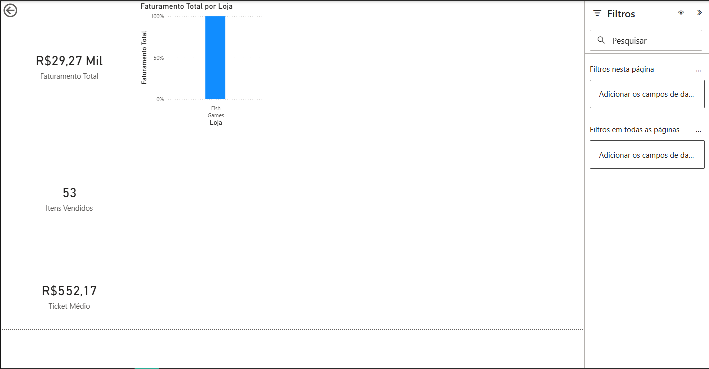

# 📊 Análise de Vendas com Power BI

## 🎯 Objetivo
Desenvolver um dashboard interativo para análise de vendas, permitindo
visualizar faturamento, volume de itens vendidos e ticket médio.

## 📂 Dataset
Dados fictícios de vendas contendo:
- Data
- Loja
- Produto
- Categoria
- Quantidade
- Valor Unitário
- Forma de Pagamento

## 📈 Métricas analisadas
- Faturamento Total
- Itens Vendidos
- Ticket Médio
- Faturamento por Loja

## 🛠️ Ferramentas utilizadas
- Power BI
- Power Query
- DAX (básico)

## 🖼️ Dashboard

## 📌 Observações
Projeto desenvolvido para fins de aprendizado e composição de portfólio
na área de Análise de Dados.
