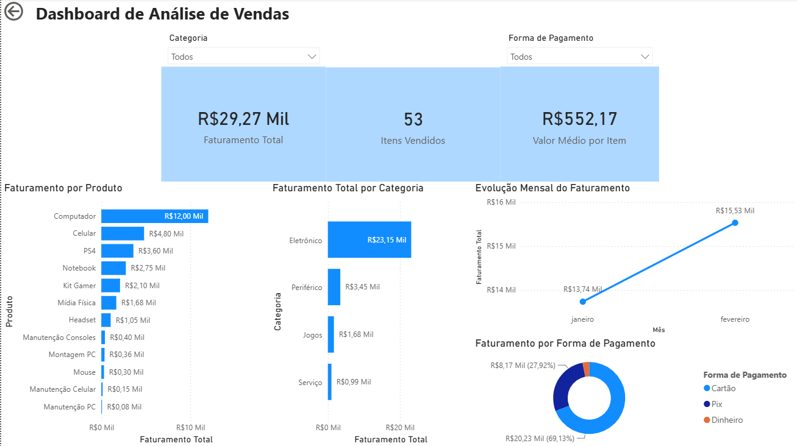

# 📊 Dashboard de Análise de Vendas

Projeto desenvolvido em **Power BI** para análise de dados de vendas, com foco no acompanhamento de faturamento, produtos, categorias e formas de pagamento.

A partir de uma base de dados em Excel, foram realizadas etapas de tratamento e padronização dos dados, criação de indicadores e desenvolvimento de um dashboard interativo para facilitar a análise dos resultados comerciais.

## 🎯 Objetivo

O objetivo do projeto é transformar dados de vendas em informações visuais que permitam analisar:

- faturamento total;
- quantidade de itens vendidos;
- valor médio por item;
- faturamento por produto;
- faturamento por categoria;
- evolução mensal do faturamento;
- distribuição do faturamento por forma de pagamento.

O dashboard também possui filtros interativos por **categoria** e **forma de pagamento**, permitindo explorar diferentes cenários da base de dados.

## 📸 Dashboard



## 📈 Principais Indicadores

| Indicador | Resultado |
|---|---:|
| Faturamento Total | R$ 29,27 mil |
| Itens Vendidos | 53 |
| Valor Médio por Item | R$ 552,17 |

> O indicador **Valor Médio por Item** representa a relação entre o faturamento total e a quantidade de itens vendidos.

## 🔍 Principais Insights

A análise dos dados permitiu identificar alguns pontos relevantes:

- A categoria **Eletrônico** apresentou o maior faturamento, totalizando **R$ 23,15 mil**.
- **Computador** foi o produto com maior faturamento, alcançando **R$ 12 mil**.
- **Celular** aparece em seguida, com **R$ 4,80 mil**, seguido por **PS4**, com **R$ 3,60 mil**.
- O faturamento aumentou de **R$ 13,74 mil em janeiro** para **R$ 15,53 mil em fevereiro**.
- O **Cartão** concentrou a maior participação no faturamento, representando aproximadamente **69%** do total.
- A análise por produto demonstra uma concentração relevante do faturamento nos produtos de maior valor.

## 🧹 Tratamento dos Dados

Antes da construção das análises, a base passou por etapas de verificação e padronização.

Entre os ajustes realizados:

- padronização dos registros de **forma de pagamento**;
- correção de inconsistências na identificação da **loja**;
- verificação dos tipos de dados;
- preparação da base para utilização no modelo do Power BI.

Essas etapas ajudam a garantir maior consistência das informações utilizadas nos indicadores e visualizações.

## 🛠️ Tecnologias Utilizadas

- **Power BI Desktop**
- **Power Query**
- **DAX**
- **Microsoft Excel**

## 📊 Visualizações e Funcionalidades

O dashboard contém:

- cartões de indicadores (KPIs);
- gráfico de barras — faturamento por produto;
- gráfico de barras — faturamento por categoria;
- gráfico de linha — evolução mensal do faturamento;
- gráfico de rosca — faturamento por forma de pagamento;
- segmentação por categoria;
- segmentação por forma de pagamento.

Os filtros permitem que os indicadores e gráficos sejam atualizados dinamicamente conforme a seleção realizada pelo usuário.

## 🧮 Indicadores

Entre as medidas utilizadas no dashboard estão:

### Faturamento Total

Representa o valor total das vendas presentes na base de dados.

### Itens Vendidos

Representa a quantidade total de itens comercializados.

### Valor Médio por Item

Calculado pela relação entre faturamento total e quantidade de itens vendidos:

```DAX
Valor Médio por Item =
DIVIDE(
    [Faturamento Total],
    [Itens Vendidos]
)
```

## 📁 Estrutura do Projeto

```text
powerbi-analise-vendas/
│
├── imagens/
│   └── dashboard-v2.png
│
├── dataset.xlsx
├── powerbi-analise-vendas.pbix
└── README.md
```

## ▶️ Como Visualizar o Projeto

1. Baixe o arquivo `powerbi-analise-vendas.pbix`.
2. Abra o arquivo utilizando o **Power BI Desktop**.
3. Utilize os filtros de categoria e forma de pagamento para explorar o dashboard.
4. A base utilizada no projeto está disponível no arquivo `dataset.xlsx`.

> Para apenas visualizar o resultado final, consulte a imagem do dashboard apresentada neste README.

## 📚 Principais Aprendizados

Durante o desenvolvimento e aprimoramento deste projeto foram trabalhados conceitos como:

- tratamento e padronização de dados;
- utilização do Power Query;
- criação e utilização de medidas DAX;
- construção de indicadores de desempenho;
- análise de faturamento;
- análise por produtos e categorias;
- criação de visualizações interativas;
- utilização de segmentadores;
- organização e apresentação de dashboards;
- identificação e comunicação de insights a partir dos dados.

## 👨‍💻 Autor

**Lucas Magalhães Amaral**

Profissional de Tecnologia da Informação direcionando a carreira para **Análise de Dados**, desenvolvendo projetos práticos utilizando Power BI, SQL, Excel e ferramentas de análise.

[LinkedIn](https://www.linkedin.com/in/lucas-magalhaes-amaral)  
[GitHub](https://github.com/Twolker23)
